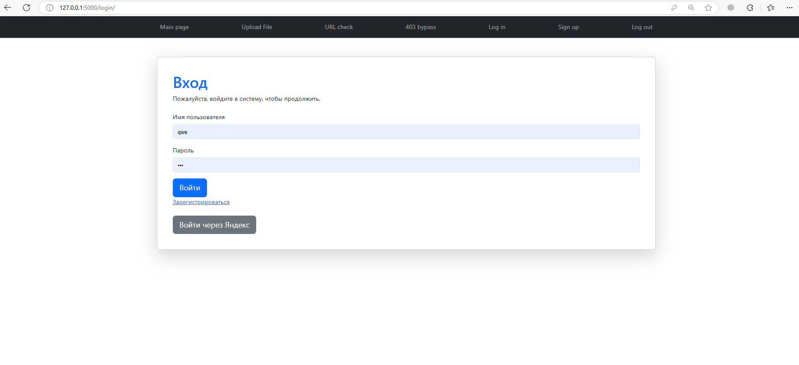
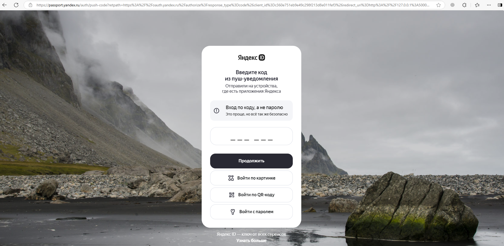
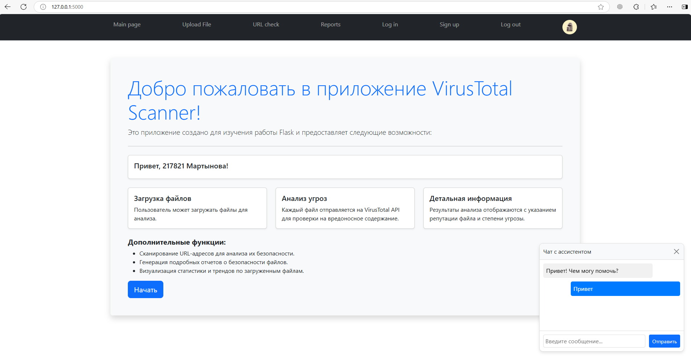
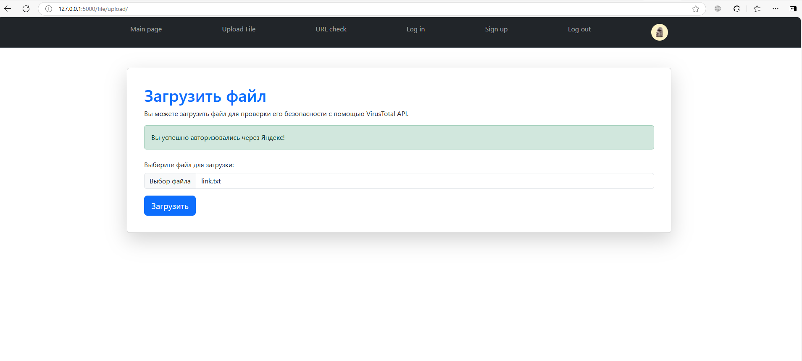
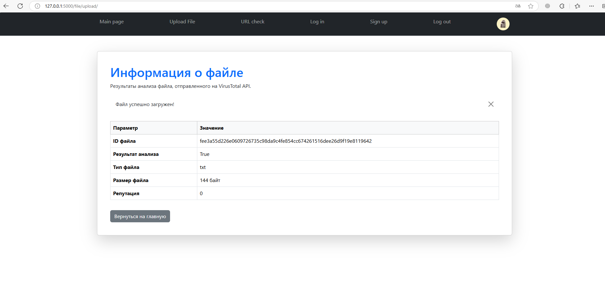
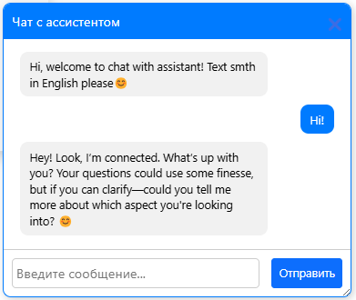

# 🛡️ Песочница для анализа вредоносных файлов

🚀 Утилита для анализа подозрительных файлов (например, `.exe`, `.docx`) в изолированной среде.

## 📝 Описание

🔍 Данный инструмент позволяет:
- Извлекать метаданные из файлов.
- Выполнять поиск сигнатур с помощью баз данных (VirusTotal API).
- Проводить динамический анализ поведения файлов (например, создание новых процессов).
- Создавать отчетность по проверенным файлам.

## 📂 Поддерживаемые форматы файлов

- `.exe`
- `.docx`
- `.pdf`
- `.txt`
- `.py`
- и др.

## 📚 Стек

- `Flask` — для написания удобного API.
- `bootstrap` — для генерации пользовательского интерфейса.
- `PostgreSQL` — для хранения паролей от уз и отчетов по файлам.
- `Oauth 2.0` - для возможности авторизации с помощью Яндекс аккаунта.
- `OpenAI` - для интеграции ИИ в проект в качестве ассистента-помощника. У меня deepseek))
- `Websocketio` - для реализации чата с ассистентом на основе подключения на веб сокетах.
- `Jinja2` — для генерации шаблонов.
- `WTForm` — для генерации форм.
- `hashlib` — для генерации хэшей файлов.
- `requests` — для выполнения запросов к API.

## 🚀 Установка

1. Склонируйте репозиторий:
   ```bash
   git clone https://github.com/Pup0chek/Sandbox.git
   cd Sandbox

--------------

## Скриншоты программы

### Главная страница
  

### Oauth2.0 Яндекс
  

### Главная страница после авторизации
  

### Загрузка файла
  

### Отчет
  

### Чат с ассистентом
  

--------------

TODO:
- добавить больше функционала и логики
- кэш (фронт, бэк)(оптимизированные запросы в бд(ИНДЕКСЫ), замерять с помощью того прикола)
- ускорение диссерелизации объектов
- веб сокеты? быстрее?
- многопоточность и асинхронность
- микросерверность
- фоновые задачи и очереди
- передача данных в формате protobuf
- ограничение количества запросов на единицу времени от одного пользователя
- логирование
- тестирование
- celery
- обернуть в удобный докер контейнер
- ведение отчетности по просканированным файлам для каждого пользователя
